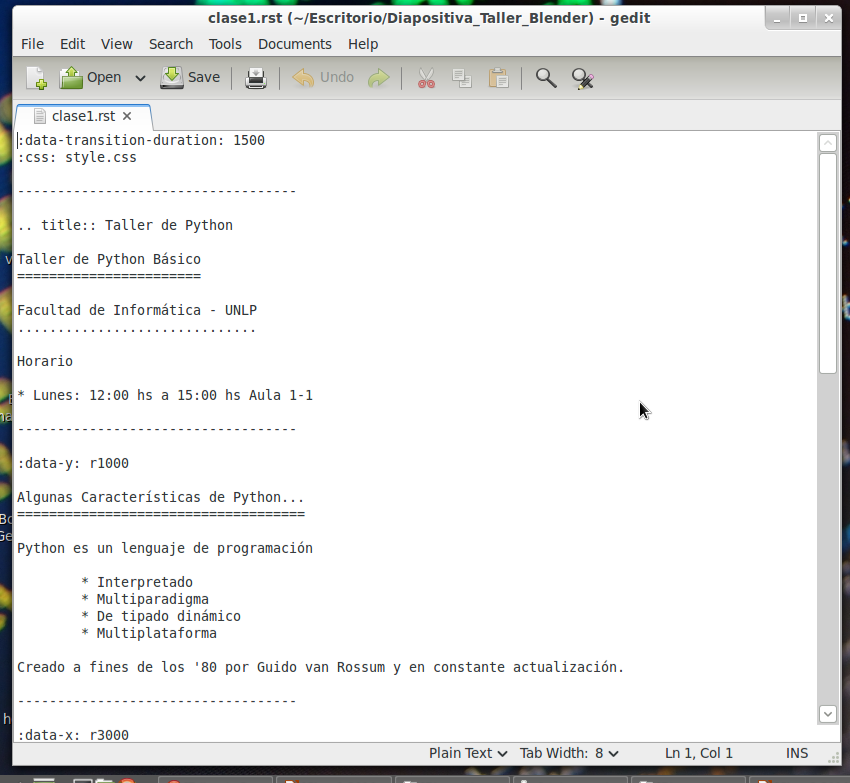
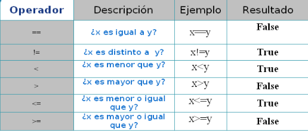

:data-transition-duration: 1500
:css: style.css

-----------------------------------

.. title:: Taller de Python

Taller de Python Básico
=======================

Facultad de Informática - UNLP
..............................

Horario

* Lunes: 12:00 hs a 15:00 hs Aula 1-1 

-----------------------------------

:data-y: r1000

Algunas Características de Python...
====================================

Python es un lenguaje de programación 
	
	* Interpretado
	* Multiparadigma
	* De tipado dinámico
	* Multiplataforma
	* Case Sensitive

Creado a fines de los '80 por Guido van Rossum y en constante actualización.

-----------------------------------

:data-x: r3000

.. image:: img/python.png
	:height: 400px
	:width: 800px

Existe una gran comunidad para este lenguaje, permitiéndonos encontrar ayuda ya sea en su propia documentación, en la wiki online o en diversos foros. Por lo que no habrá problemas que no podamos resolver.

----------------------------------

:data-rotate: 90
:data-x: r2000

Sirve Para Algo ?
=================

Python es usado en diversas empresas o programas, como por ejemplo:

* Twitter
* Yahoo
* Google
* NASA
* IBM
* etc...

-------------------------------

:data-y: r1500
:data-x: r-1500

Y en algo que podamos ver ?
===========================

Un ejemplo rápido sería **esta diapositiva**, la cual fue realizada con hovercraft 1.1, desarrollado en Python 3.2.

Permitiéndonos hacer presentaciones de impress.js usando reStructuredText sin tocar ni una línea de HTML.

------------------------------

Ejemplo:
========

------------------------------

:data-rotate: -90
:data-z: r-2000

--> Contenidos del curso <--
============================

#. Variables (Tipos básicos y colecciones)
#. Estructuras de Control
#. Modulos y Funciones
#. Archivos

------------------------------

:data-rotate: 90
:data-z: r2000
:data-x: r1000

Comentarios
===========

Saber comentar nuestro código es muy importante. Podemos comentar un texto de 2 formas diferentes.

1. Comentar una línea:

.. code:: python

	# Hola, soy un comentario de una sola linea.

2. Comentar varias lineas

.. code:: python
	
	"""Y yo,
		Soy Un comentarios
		de varias
		lineas"""

------------------------------

:data-y: r1500
:data-rotate: 180

Funciones Útiles
================

.. code:: python

	type(dato)	#Devuelve el tipo de dato, ideal para hacer debugging
	input("Mensaje") #Guardamos la entrada del teclado
	help(dato)	#Obtendremos toda la info y métodos sobre el tipo de dato.
	exit()	#Salimos de Python :D
	
	
	
	
------------------------------

:data-x: r2300

Variables
=========

Las variables representan valores. Por ejemplo:

.. code:: python

	x = 3

En este caso, x representa o referencia al dato entero 3.

Las variables en Python **No se Declaran** y los nombres de las mismas pueden contener letras y números (también "_"). Eso si, deben de comenzar con una letra.
 
-------------------------------

:data-x: r1200
:data-rotate: 90

Variables
=========

Las asignaciones de las variables en python pueden realizarse de a varias al mismo tiempo, de la forma:

.. code:: python

	a = b = c = 99
	
o

.. code:: python
	
	a, b, c = 10, 20, 30
	
Todas son formas válidas de asignar valores a las variables. Recordar que la legibilidad de un programa es muy importante.

Como python es Case Sensitive, no es lo mismo la variable X que x.

--------------------------------

:data-z: -3000
:data-x: r1500

Tipos de Datos
==============

* Básicos
	* Numéricos
		* Enteros
		* Flotantes
		* Conplejos
	* Booleanos
	* Strings
* Colecciones
	* Listas
	* Tuplas
	* Diccionarios
	* Conjuntos (Set)
	
----------------------------------

:data-x: r1500

Tipos Numéricos
===============

* Enteros:

.. code:: python

	x = 3
	y = 9873
	
* Flotantes:

.. code:: python

	x = 1.4
	y = 123.34221
	
* Complejos

.. code:: python

	# No vamos a verlos en el curso :D
	x = 1j

---------------------------------

:data-rotate: 180
:data-y: r1500

Operaciones Numéricas
=====================

*Variables Numéricas*

* **Suma**						a + b
* **Resta**						a - b
* **Multiplicación**			a * b
* **Potencia**					a**b
* **División Entera**			a // b
* **Resto de la División**		a % b

*Nivel Bit*

* **And**			&
* **Or**			|
* **Xor**			^
* **Not**			-
* **Despl Izq**		<<
* **Despl Der**		>>

--------------------------------

:data-x: r1500

Booleanos
=========

Pueden contener solo dos valores: True o False

.. code:: python

	# Si..
	x = 1
	y = 2
	
Las operaciones igual, distinto, menor, menor igual, mayor, mayor igual devuelven booleanos.

	

--------------------------------

:data-rotate: 90
:data-y: r1500

Strings
=======

Los Strings son cadenas de carácteres (números, letras, símbolos..)

Podemos declararlos con comillas simples ' ' o dobles ""

.. code:: python
	
	x = "Hola "
	y = 'Mundo'
	
Podemos:

.. code:: python

	#Concatenación
	print(x + y)
	
	#Repetición
	print(x * 5)
	
Si queremos Escapar un símbolo usamos \.

.. code:: python
	
	#Estamos Escapando la comilla en si.
	print("Hola \"Mundo\"")
	
----------------------------------

:data-x: r1500

Strings
=======

Podemos usar los mismos operadores de comparación de los números, con los strings (==, !=, <, >, >=, <=). El orden es alfabético.

Para esto, python utiliza el código ASCII de cada caracter para saber su orden.

Por lo que:

.. code:: python

	"casa" < "caso"
	
Dará como resultado True. Python compara carácteres por su orden.

--------------------------------------------------------

:data-rotate: 90
:data-y: r1500

Strings
=======

*Funciones útiles:* 

* **ord()** *Nos devuelve el ASCII del caracter* 
* **chr()** *Nos pasa el caracter del numero ASCII que pasemos*
* **int()** *Convierte un String en Entero*
* **float()** *Convierte un String en Flotante*
* **str()** *Convierte un Número en String*
* **len()** *Longitud del String*

.. code:: python

	ord("a")		#Devuelve 97
	chr(97)			#Devuelve "a"
	int("123") 		#Devuelve el número 123
	float("123")		#Devuelve el número 123.0
	str(123)		#Devuelve el String "123"
	len("Hola")		#Devuelve 4
	
Dado:

.. code:: python

	a = "Hola Mundo"
	a.lower() 		#Devuelve el String pero en minúscula
	a.upper()		#Devuelve el String pero en mayúscula

------------------------------------------------------------

:data-x: r1500

Estructuras de Datos
====================

*Veremos*

#. **Listas**
#. **Tuplas**
#. **Diccionarios**
#. **Conjuntos(Sets)**

Cada estructura de datos cuenta con sus características especiales.

-------------------------------------------------------------

:data-rotate: 90
:data-y: r1500

Listas
======

Una lista es una estructura de datos **Heterogénea**, **Ordenada** e **Indexada**. Pueden cambiar su contenido (tipos de datos) y tamaño en tiempo de ejecución.

Ejemplo:

.. code:: python

	myLista = [12, 34.0, "Hola Mundo", [1, 2], True]
	
Podemos acceder a los elementos de la lista a través de los []:

.. code:: python 

	print("El elemento 0 de la lista es: " + myLista[0])
	
El primer elemento de la lista se encuentra en la posición 0.

Podemos asignar valores también con []

.. code:: python

	# Reemplazamos el valor 34.0 por el booleano False
	myLista[1] = False

-----------------------------------------------------------------

:data-x: r1500

Listas
======

Si queremos acceder a la lista dentro de myLista, se utilizan otro juego de []

.. code:: python

	myLista = [1, [True, 2]]
	
	#Imprimimos el True
	print(myLista[1][0])
	
Así como accedemos a la lista con ínidices positivos, también podemos hacerlo con índices negativos.

.. code:: python

	lista = [1, 2]
	print(lista[-1])	#Imprime 2
	
--------------------------------------------------------------------

:data-rotate: 90
:data-x: r1500
:data-y: r1000

Listas
======

Slicing
.......

El Slicing nos permite obtener sublistas de una lista. Para eso, debemos de indicar el elemento inicio y el fin. El fin debe de ser +1 a la posición del elemento que queremos

.. code:: python

	lista = [1, 2, 3, 4]
	print(lista[1:3])
	
Podemos obviar el inicio o final y python tomará las posiciones de inicio o fin por defecto. lista[:3] == lista[0:3]

EL slicing también nos permite modificar la lista.

.. code:: python

	lista = [1, 2, 3, 4, 5]
	lista[0:2] = [1] 			#Reemplazamos esa sublista por el 1.
	print(lista)

---------------------------------------------------------------------

:data-x: r1500

Listas
======

**Copiado**

Puede ser tentador realizar lista1 = lista2, esto hará que las dos variables apunten a la misma posición en memoria, por lo que si cambiamos elementos desde lista, también se verá esto reflejado en lista2.

Para copiar, hacemos uso de la función copy().

.. code:: python

	lista1 = [1, 2]
	lista2 = [] 			#Lista vacía
	lista2 = lista1.copy()		#Copiamos lista 1.
	lista2 = lista1[:]		#También estamos copiando lista 1.
	
Podemos también "concatenar" listas como con string, también multiplicar.

.. code:: python

	lista1 = [1, 2]
	lista2 = lista1 + [3, 4]
	lista2 = lista1 * 2
	
--------------------------------------------------------------------

:data-y: r1500

Listas
======

Podemos Extender la lista con la función extend() agregando elementos al final o append() para agregar un elemento al final.

**Eliminar Elementos**

.. code:: python

	lista = [1, 3, 55, 55]
	del lista[2]			#Elimina el elemento en la posición 2 de la lista
	lista.remove(55)		#Elimina la primera ocurrencia del elemento.
	elemento = lista.pop(0)		#Elimina y me devuelve el elemento en la posición 0

**Más funciones Útiles**

.. code:: python

	lista.count(X) 		#Nos devuelve las ocurrencias de X en la lista
	len(lista)		#Cantidad de elementos en la lista
	lista.index(X)		#Posición del elemento X en la lista.
